# 🎓 Student Performance Predictor
### Personalised Learning Pathways Using AI-Based Student Behaviour Analysis
**Built by Manikant | B.Tech CSE (AI & ML) | Sharda University**

[](https://colab.research.google.com/github/Manikant-14/Student_Performance_Predictor/blob/main/AI_Based_Student_Behavior_Analysis_.ipynb)


---

## 📌 Overview

An **explainable machine learning pipeline** that predicts whether a secondary-school student will **pass or fail mathematics** using *only behavioural and demographic features*, with no prior grades. Each prediction is explained with **SHAP**, and the explanation is turned into a **personalised intervention plan** for at-risk students.

Most performance models lean on earlier grades (G1, G2), so the warning arrives too late. This project deliberately removes them to test a harder question: **can habits and background alone flag a student early enough to help?**

**Research questions**
- **RQ1:** Can student performance be predicted from behaviour and demographics alone?
- **RQ2:** Which behavioural features most strongly drive poor performance?
- **RQ3:** Can explainability be used to build personalised learning pathways?

A full written report is included in [`report/`](report/Student_Performance_Report.docx).

---

## 🏗️ Architecture

```
UCI Student Performance (Maths) — 395 students, 33 columns
        ↓
   EDA                       ← grade distribution, correlations, behaviour vs outcome
        ↓
   Preprocessing             ← binary target (G3 ≥ 10 = Pass), label-encode categoricals,
        ↓                       drop G1 / G2 / G3 to prevent leakage
   Stratified 80/20 split    ← identical 67.1% pass rate in train and test
        ↓
   ┌──────────────────────────┬──────────────────────────┐
   │  Random Forest           │  XGBoost                 │
   │  GridSearchCV (5-fold F1)│  GridSearchCV (5-fold F1)│
   └────────────┬─────────────┴─────────────┬────────────┘
                └────────────┬──────────────┘
                             ↓
                Evaluation (Accuracy · F1 · ROC-AUC · 5-fold CV)
                             ↓
                SHAP TreeExplainer   ← global + per-student explanations
                             ↓
                Intervention Engine  ← top-3 SHAP risk factors → actions
```

---

## 🛠️ Tech Stack

| Layer | Technology |
|---|---|
| Language | Python 3.10+ |
| Data handling | pandas, NumPy |
| Visualisation | Matplotlib, Seaborn |
| Models | scikit-learn `RandomForestClassifier`, XGBoost `XGBClassifier` |
| Tuning | `GridSearchCV`, `StratifiedKFold` |
| Explainability | SHAP (`TreeExplainer`) |
| Runtime | Google Colab / local Jupyter |

---

## 📁 Project Structure

```
Student_Performance_Predictor/
├── AI_Based_Student_Behavior_Analysis_.ipynb   # Full pipeline: EDA → models → SHAP → interventions
├── data/
│   └── student-mat.csv                         # UCI Student Performance (Mathematics)
├── report/
│   └── Student_Performance_Report.docx         # Written research report
├── images/                                     # Figures generated by the notebook
├── requirements.txt
├── .gitignore
├── LICENSE
└── README.md
```

---

## 📊 Dataset

| Property | Value |
|---|---|
| Source | [UCI ML Repository — Student Performance](https://archive.ics.uci.edu/dataset/320/student+performance) (Cortez & Silva, 2008) |
| Subset | Mathematics course |
| Students | 395 |
| Input features | 30 (after removing G1, G2, G3) |
| Target | `pass = 1` if final grade `G3 ≥ 10` (grades run 0–20), else `0` |
| Class balance | 265 Pass (67.1%) / 130 Fail (32.9%) |
| Missing values | None |

**Feature groups:** demographics (age, sex, address), family (parents' education/jobs, family size, relationship quality), study habits (study time, past failures, school/family support, paid classes), social life (going out, free time, alcohol use, romantic relationship), health and absences.

A copy of the CSV is in [`data/`](data/student-mat.csv); the notebook also downloads it straight from UCI.

### Exploratory analysis

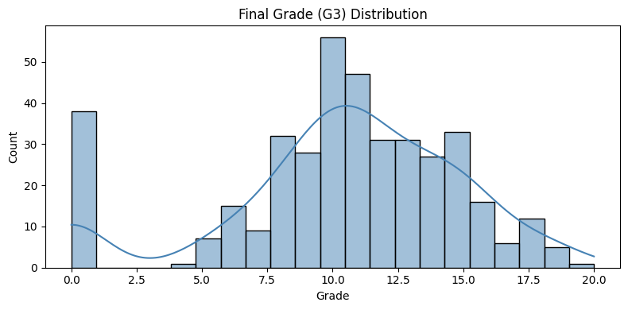
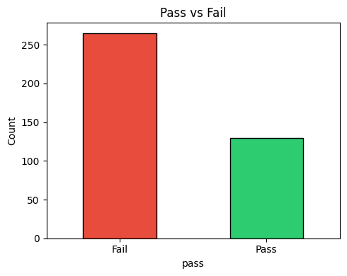
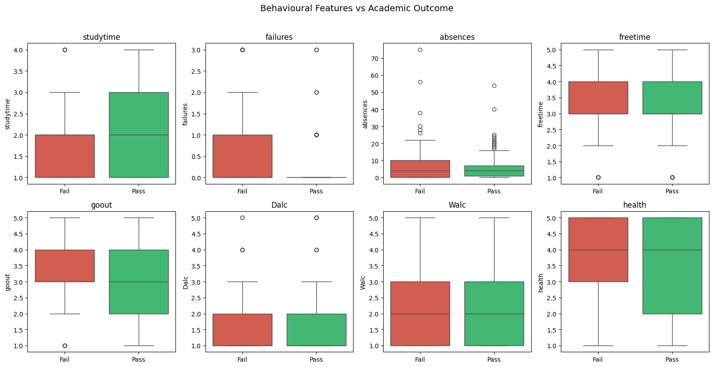
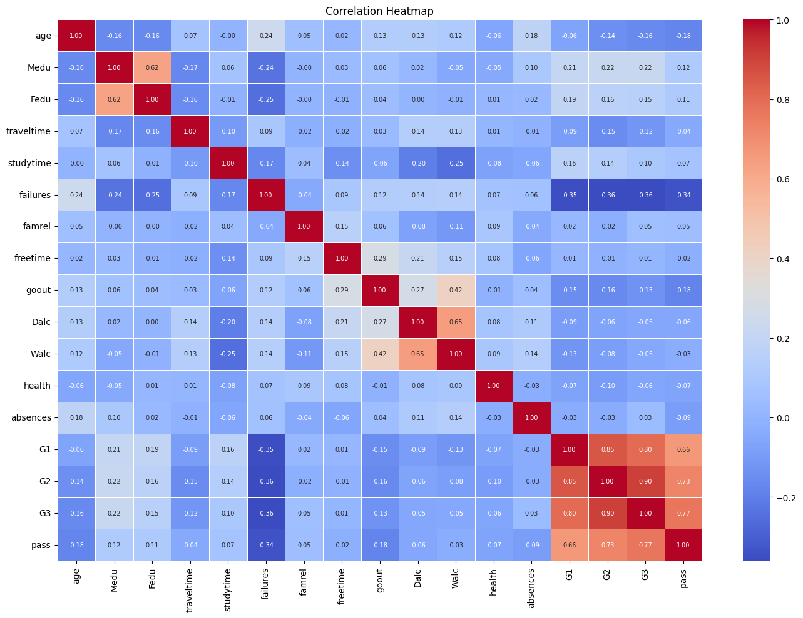

---

## 🚀 How to Run

### Option A — Google Colab (recommended)

1. Click the **Open in Colab** badge at the top.
2. Choose **Runtime → Run all**. Dependencies install and the dataset downloads automatically.

### Option B — Local

```bash
# 1. Clone the repo
git clone https://github.com/Manikant-14/Student_Performance_Predictor.git
cd Student_Performance_Predictor

# 2. Create a virtual environment
python -m venv venv
source venv/bin/activate        # Windows: venv\Scripts\activate

# 3. Install dependencies
pip install -r requirements.txt

# 4. Launch the notebook
jupyter notebook AI_Based_Student_Behavior_Analysis_.ipynb
```

The notebook fetches the dataset from UCI on the first run. To use the bundled copy instead, read `data/student-mat.csv` with `sep=";"`.

---

## 📈 Results

Evaluated on a stratified held-out test set (20%, **n = 79**), with hyperparameters chosen by 5-fold `GridSearchCV` on F1.

| Model | Accuracy | F1 (Pass) | ROC-AUC | 5-fold CV F1 |
|---|---|---|---|---|
| **Random Forest** | **0.709** | **0.807** | **0.615** | **0.815 ± 0.024** |
| XGBoost | 0.633 | 0.729 | 0.571 | 0.754 ± 0.038 |

**Best hyperparameters**
- Random Forest: `n_estimators=100`, `max_depth=None`, `min_samples_split=5`, `class_weight='balanced'`
- XGBoost: `n_estimators=200`, `max_depth=7`, `learning_rate=0.1`, `scale_pos_weight≈0.49`

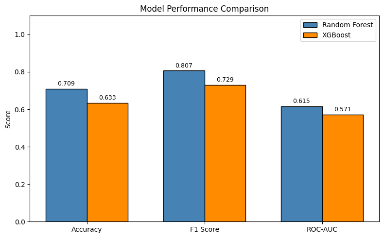
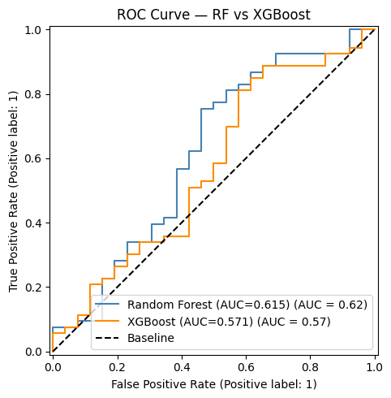

### Random Forest per-class performance

| Class | Precision | Recall | F1 | Support |
|---|---|---|---|---|
| Fail | 0.62 | 0.31 | 0.41 | 26 |
| Pass | 0.73 | 0.91 | 0.81 | 53 |

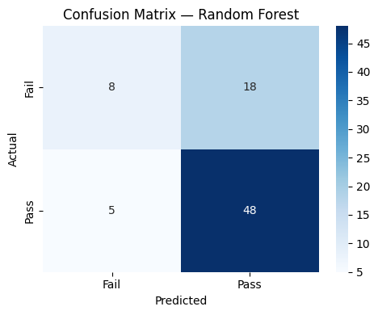
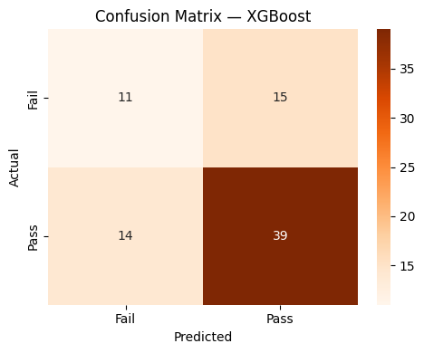

**Reading the results honestly:** Random Forest beats XGBoost on every metric, but the absolute signal is modest. Without grade features, ROC-AUC sits around 0.62 and the model catches roughly **31% of failing students**. It is a screening aid to prioritise attention, not a replacement for teacher judgement.

---

## 🔍 Explainability (SHAP)

SHAP `TreeExplainer` is applied to the tuned Random Forest, using the **Pass**-class values.

**Top drivers pushing students toward failing** (mean |SHAP|):

| Rank | Feature | Meaning |
|---|---|---|
| 1 | `failures` | Number of past class failures |
| 2 | `goout` | Going out with friends (1 = very low … 5 = very high) |
| 3 | `absences` | Number of school absences |

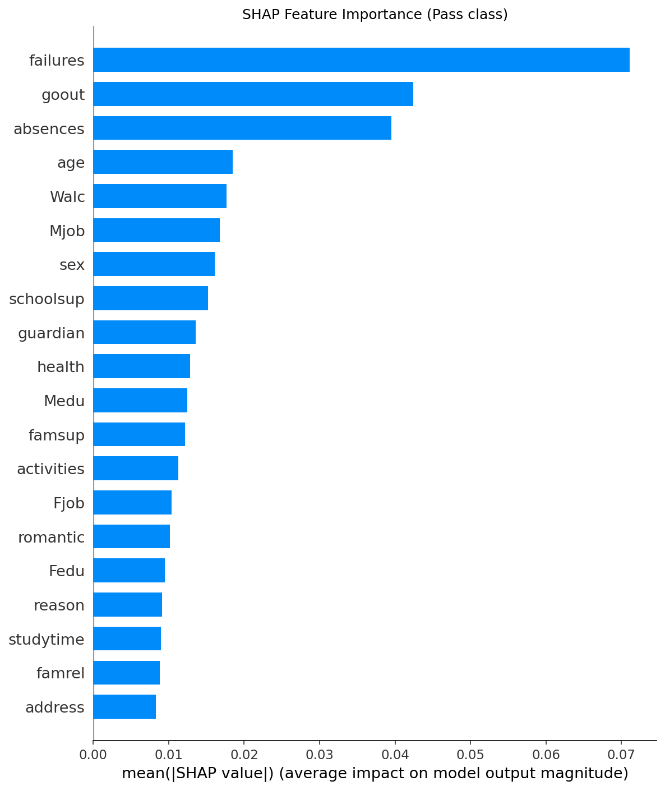
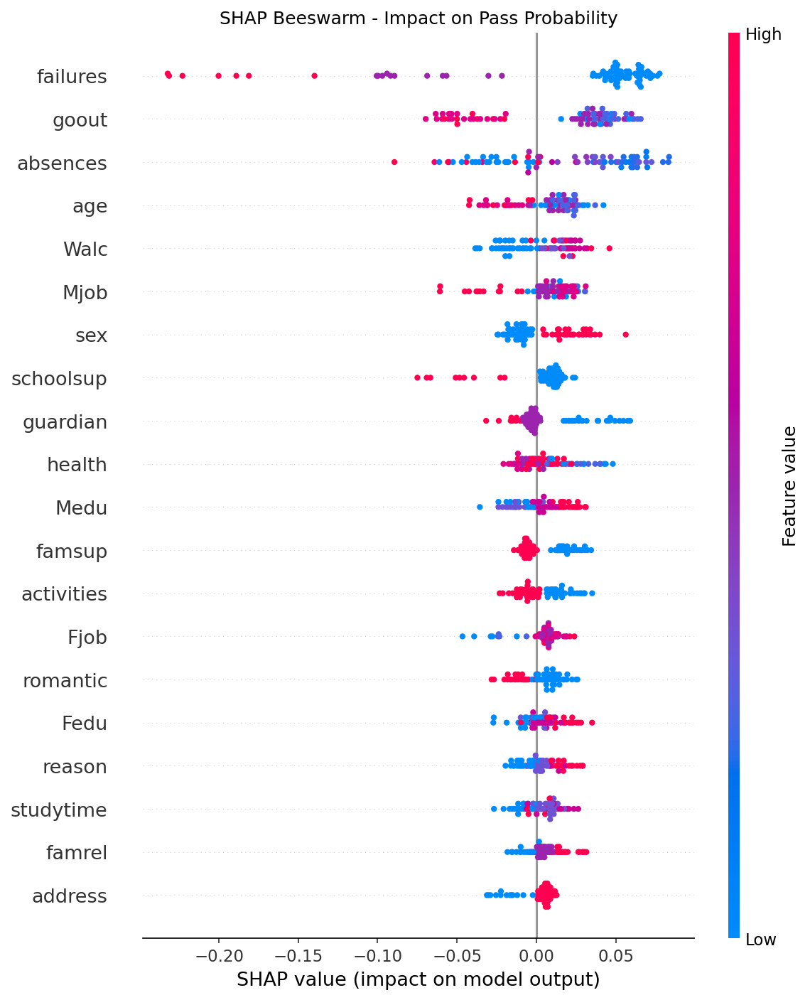
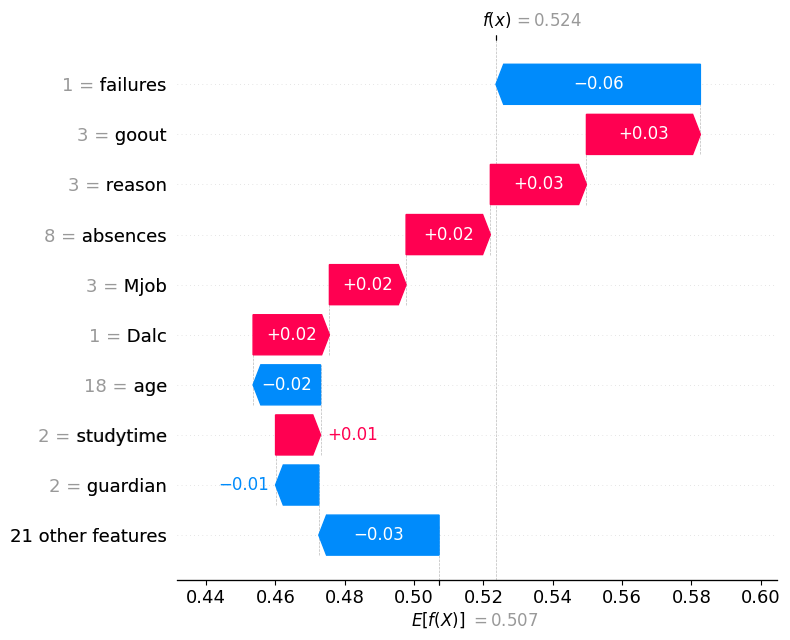

---

## 🎯 Personalised Intervention Engine

`generate_intervention()` takes one student, predicts pass/fail, pulls their **three most negative SHAP contributors**, and maps each to a concrete action (11 behavioural features covered: study time, failures, absences, free time, going out, weekday/weekend alcohol, health, family relationship, internet access, romantic distraction).

### Sample output (real notebook run)

```
=======================================================
Student 16 | Predicted: Fail | Pass Prob: 0.3095

Risk Factors (SHAP):
  - failures: -0.2314
  - absences: -0.0239
  - goout: -0.0201

Recommended Interventions:
  → Enrol in remedial or tutoring support.
  → Attendance monitoring and counselling needed.
  → Balance social outings with study schedule.
```

Features with no mapped action (for example `Mjob` or `traveltime`) are skipped, so a student may receive fewer than three suggestions.

---

## ⚙️ Design Decisions

**Why drop G1, G2 and G3?**
The pass label is derived from G3, and G1/G2 are earlier grades that almost determine it. Keeping them gives high accuracy but a useless early-warning system. Removing them is what makes the question meaningful.

**Why a binary pass/fail target at G3 ≥ 10?**
10/20 is the standard passing mark in the Portuguese system, and a binary label makes the output directly actionable for interventions.

**Why optimise F1 rather than accuracy?**
The classes are imbalanced (67/33). F1 keeps the search from settling on a model that just predicts "Pass" for everyone. Class imbalance is also handled with `class_weight='balanced'` (RF) and `scale_pos_weight` (XGBoost).

**Why Random Forest and XGBoost?**
Both handle mixed tabular features and feature interactions without scaling, and both have fast native SHAP support through `TreeExplainer`.

**Why SHAP rather than plain feature importance?**
Global importance says which features matter on average; SHAP says why *this* student was flagged and in which direction each feature pushed. That per-student view is what makes a *personalised* pathway possible.

**Why a stratified split?**
It keeps the 67.1% pass rate identical in train and test, which matters with only 79 test samples.

---

## ⚠️ Limitations

- **Modest predictive power.** ROC-AUC ≈ 0.62 and Fail recall of 0.31: many at-risk students are missed.
- **Small data.** 395 students and a 79-student test set mean the metrics have real variance.
- **Single context.** Data comes from two Portuguese secondary schools and may not transfer elsewhere.
- **Optimistic CV.** The 5-fold CV reported in the summary runs on the full dataset with hyperparameters that were tuned on the training split, so those figures are slightly optimistic. The held-out test scores are the more honest numbers.
- **Label encoding** is used for nominal features (for example `Mjob`). This is acceptable for tree models but imposes an arbitrary order.
- **Association, not causation.** SHAP shows what the model relies on, not what causes failure.
- **Rule-based interventions.** The suggestions are a hand-written lookup on top of SHAP output, not a validated pedagogical policy. Sensitive features (alcohol use, relationships) should be handled with care and human oversight.

---

## 🔮 Future Work

- Train on larger, multi-school datasets to improve generalisation
- Weight interventions by SHAP magnitude so severity drives priority
- Try one-hot encoding and probability calibration; evaluate on both the Maths and Portuguese-language subsets
- Explore neural approaches for non-linear behaviour patterns
- Wrap the model in a small Streamlit/FastAPI app for teachers
- Run a controlled study to measure whether the interventions actually help

---

## 📋 Assumptions

- Grades follow the Portuguese 0–20 scale; **pass = G3 ≥ 10**
- Only behavioural and demographic features are used at prediction time
- `random_state=42` is used throughout for reproducibility
- The Mathematics subset (`student-mat.csv`) is used; the Portuguese-language subset is not
- Intervention text is illustrative

---

## 📄 Report

The full research report (introduction, literature review, methodology, results, discussion, references) is in [`report/Student_Performance_Report.docx`](report/Student_Performance_Report.docx).

---

## 👤 Author

**Manikant**
- GitHub: [github.com/Manikant-14](https://github.com/Manikant-14)
- LinkedIn: [linkedin.com/in/manikant14](https://linkedin.com/in/manikant14)
- Email: manikantmgr14@gmail.com

---

## 📚 Reference

P. Cortez and A. Silva. *Using Data Mining to Predict Secondary School Student Performance.* In A. Brito and J. Teixeira (Eds.), Proceedings of the 5th Future Business Technology Conference (FUBUTEC 2008), pp. 5–12, Porto, Portugal, April 2008.

---

*Built as an AI/ML portfolio project — June 2026*
